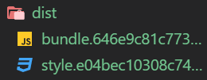

# Section4. Plugins

플러그인의 필요성
* 앞서 Loader를 통해 자바스크립트가 아닌 파일도 자바스크립트에서 사용할 수 있게 했다
* 그러나 기존에 없었던 혹은 잘 사용되지 않는 파일이라면 로더가 없을 것이다
* 그 이외에도 플러그인은 로더가 할 수 없는 많은 기능들을 가지고 있다
* 예를 들어, 글로벌 상수를 만드는 것, bundle.js이외의 파일을 생성하는 것, 코드의 공백을 제거해 용량을 줄여 빠르게 다운로드 가능하도록 만드는 것이 가능하다

코드 간격을 없애 파일 크기를 축소시키는 플러그인 적용하기
```js
const path = require('path');
const TerserPlugin = require('terser-webpack-plugin');

module.exports = {
  entry: './src/index.js',
  output: {
    filename: 'bundle.js',
    path: path.resolve(__dirname, './dist'),
    publicPath: 'dist/'
  },
  mode: 'none',
  module: {
    rules: [
      {
        test: /\.(png|jpg)$/,
        use: [
          'file-loader'
        ]
      },
      {
        test: /\.css$/,
        use: [
          'style-loader', 'css-loader'
        ]
      },
      {
        test: /\.(scss|sass)$/,
        use: [
          'style-loader', 'css-loader', 'sass-loader'
        ]
      },
      {
        test: /\.js$/,
        exclude: '/node_modules/',
        use: {
          loader: 'babel-loader',
          options: {
            presets: [ '@babel/env' ],
            plugins: [ 'transform-class-properties' ]
          }
        }
      }
    ]
  },
  plugins: [
    new TerserPlugin()
  ]
}
```
* plugins프로퍼티에 배열로 플러그인들을 추가할 수 있다
* 여기서는 코드축소를 위한 TerserPlugin만 추가했다
  - TerserPlugin은 Uglifyjsplugin과 같은 목적으로 사용되는 플러그인이다

TerserPlugin 설치하기
```terminal
$ npm i --save-dev terser-webpack-plugin
```

번들 사이즈 비교하기
```txt
TerserPlugin 적용 전
Asset      Size
bundle.js  15.6 KiB

TerserPlugin 적용 후
Asset      Size
bundle.js  5.49 KiB
```

---

css를 style태그 안이 아닌 별도의 파일로 생성하기
```js
const path = require('path');
const TerserPlugin = require('terser-webpack-plugin');
const MiniCssExtractPlugin = require('mini-css-extract-plugin'); // css를 별도 파일로 추출해내는 모듈추가

module.exports = {
  entry: './src/index.js',
  output: {
    filename: 'bundle.js',
    path: path.resolve(__dirname, './dist'),
    publicPath: 'dist/'
  },
  mode: 'none',
  module: {
    rules: [
      {
        test: /\.(png|jpg)$/,
        use: [
          'file-loader'
        ]
      },
      {
        test: /\.css$/,
        use: [
          // style-loader를 제거하고 새로운 로더 적용
          MiniCssExtractPlugin.loader, 'css-loader'
        ]
      },
      {
        test: /\.(scss|sass)$/,
        use: [
          // style-loader를 제거하고 새로운 로더 적용
          MiniCssExtractPlugin.loader, 'css-loader', 'sass-loader' 
        ]
      },
      {
        test: /\.js$/,
        exclude: '/node_modules/',
        use: {
          loader: 'babel-loader',
          options: {
            presets: [ '@babel/env' ],
            plugins: [ 'transform-class-properties' ]
          }
        }
      }
    ]
  },
  plugins: [
    new TerserPlugin(),
    // 플러그인 추가
    new MiniCssExtractPlugin({
      filename: 'style.css' // 파일이름 지정하기
    })
  ]
}
```
* 추가, 변경된 부분은 주석으로 설명되어 있다

html에서 css파일을 불러오도록 수정하기
```html
<!DOCTYPE html>
<html lang="en">
<head>
  <meta charset="UTF-8">
  <meta name="viewport" content="width=device-width, initial-scale=1.0">
  <meta http-equiv="X-UA-Compatible" content="ie=edge">
  <link rel="stylesheet" href="./dist/style.css" /> <!-- 추출할 css파일 경로와 이름 지정 -->
  <title>Document</title>
</head>
<body>
  <script src="./dist/bundle.js"></script>
</body>
</html>
```

플러그인 설치하기
```terminal
$ npm i mini-css-extract-plugin --save-dev
```
* 빌드 후 잘 적용되어 있는지 확인해보자

---

컴포넌트 하나를 더 생성해서 별도의 파일로부터 하나의 css파일 추출하기
```js
// src/components/heading/Heading.js
import './heading.scss';

class Heading {
  render() {
    const h1 = document.createElement('h1');
    const body = document.querySelector('body');
    h1.innerHTML = "Webpack is awesome";
    body.appendChild(h1);
  }
};

export default Heading;
```

```scss
/* src/components/heading/heading.scss */
h1 {
  color: gray;
}
```

```js
// src/index.js
import HelloWorldButton from './components/hello-world-button/hello-world-button';
import Heading from './components/heading/Heading';

const heading = new Heading();
heading.render();
const helloWorldButton = new HelloWorldButton();
helloWorldButton.render();
```

빌드하고 확인해보기
```terminal
$ npm run build
```

추출된 style.css파일
```css
.hello-world-button {
  font-size: 20px;
  padding: 7px 15px;
  background: green;
  color: white;
  outline: none; }

.hello-world-text {
  color: red;
  font-weight: bold; }

h1 {
  color: gray; }
```
* 기존의 hello-world-button 컴포넌트의 scss코드와 heading 컴포넌트의 scss코드가 합쳐진 것을 확인할 수 있다

---

캐시를 사용해 성능 향상하기
* 사용자가 웹사이트에 접속할 때마다 매번 같은 파일을 받는 것은 비효율적이다
* 특히 저사양의 모바일 디바이스를 사용하는 사용자일수록 사용성이 급감할 것이다
* 따라서 클라이언트 기기의 특정 장소에 파일을 저장해두고 저장된 파일과 같은 파일을 요청하면 새로 파일을 받아오지 않고 이미 저장된 파일을 사용하는 것이 좋다
* 그런데 이 때 한가지 문제점이 발생할 수 있다
  - 만일 사이트 공급자가 새로운 기능을 추가했다면 사용자 컴퓨터가 이를 어떻게 인식할 수 있을까
  - 이 문제는 일반적으로 새로운 기능이 추가된 파일을 만들 때에는 파일이름을 변경하는 것으로 해결한다
  - 브라우저가 새롭게 변경된 파일이름을 보면 캐시를 사용하지 않고 다운받게끔 하는 것이다
  - 물론 개발자가 직접 파일이름을 변경해야 하는 것은 아니다
  - 웹팩을 통해 자동으로 파일이름을 변경할 수 있다

contenthash를 output에 추가하기
```js
// (...)
module.exports = {
  entry: './src/index.js',
  output: {
    filename: 'bundle.[contenthash].js',
    path: path.resolve(__dirname, './dist'),
    publicPath: 'dist/'
  },
  // (...)
}
```

빌드하고 확인해보기
```terminal
$ npm run build
```


* 이제 bundle.뒤에 있는 hash값을 기준으로 브라우저가 캐시를 사용할지 말지를 결정할 수 있다
* 자바스크립트 코드를 변경하지 않고 다시 한 번 빌드해보면 같은 MD5해시값이 적힌 번들파일이 생성됨을 확인할 수 있을 것이다
  
코드를 변경하고 빌드해보기
```js
// src/index.js
import HelloWorldButton from './components/hello-world-button/hello-world-button';
import Heading from './components/heading/Heading';

const heading = new Heading();
heading.render();
const helloWorldButton = new HelloWorldButton();
helloWorldButton.render();

const ten = 10; // 테스트를 위한 코드 추가
```

빌드하고 확인해보기
```terminal
$ npm run build
```


* 코드를 변경한 후 빌드해보면 해쉬값이 변경된 것을 확인할 수 있다
* 추가했던 const ten = 10;은 의미 없는 코드이므로 삭제해두자

css에도 해쉬값을 사용해 같은 기능 적용하기
```js
// (...)
module.exports = {
  // (...)
  plugins: [
    new TerserPlugin(),
    new MiniCssExtractPlugin({
      filename: 'style.[contenthash].css'
    })
  ]
};
```

빌드하고 확인해보기
```terminal
$ npm run build
```


* css파일에도 해쉬값이 추가되었음을 확인할 수 있다
* 앞서 자바스크립트에 추가했던 const ten = 10;을 삭제했기 때문에 자바스크립트 파일도 새로운 해쉬값이 적용된 파일이 생성됐다.

---

dist폴더에 이전에 생성된 파일을 자동으로 삭제하기
* 업데이트에 따라 새로운 해쉬값이 적용된 파일을 생성하게끔 만들었다
* 그런데 파일이 많아지는 것을 수동으로 삭제하는 것은 매우 귀찮은 작업이다
* clean-webpack-plugin을 사용하면 파일삭제를 자동으로 처리할 수 있다
* 이 플러그인은 빌드된 파일을 생성하기 이전에 output폴더 경로의 모든 파일을 삭제해준다

webpack.config.js에 clean-webpack-plugin 적용하기
```js
const path = require('path');
const TerserPlugin = require('terser-webpack-plugin');
const MiniCssExtractPlugin = require('mini-css-extract-plugin');
const { CleanWebpackPlugin } = require('clean-webpack-plugin'); // 플러그인 불러오기

module.exports = {
  // (...)
  plugins: [
    new TerserPlugin(),
    new MiniCssExtractPlugin({
      filename: 'style.[contenthash].css'
    }),
    new CleanWebpackPlugin()
  ]
};
```

플러그인 설치하기
```terminal
$ npm i clean-webpack-plugin --save-dev
```

빌드하고 확인해보기
```terminal
$ npm run build
```


* 가장 최근에 생성된 파일만 남아있는 것을 확인할 수 있다

여러 폴더에 있는 파일에 clean-webpack-plugin 사용해보기
* 우선 dist폴더와 동등한 계층에 buiid 폴더를 만들자
  - 그리고 build폴더 안에 file1.css를 생성한다
  - subfolder폴더를 추가하고 subfolder에 file2.css를 생성한다
* 위에서 설명한 대로 추가했다면 다음과 같은 폴더 구조가 되어 있을 것이다
  

* 이제 build폴더 안의 내용까지 플러그인을 사용해 삭제해보자

webpack.config.js파일에 설정 추가하기
```js
// (...)

module.exports = {
  // (...)
  plugins: [
    new TerserPlugin(),
    new MiniCssExtractPlugin({
      filename: 'style.[contenthash].css'
    }),
    new CleanWebpackPlugin({
      cleanOnceBeforeBuildPatterns: [
        '**/*', 
      ]
    })
  ]
}
```
* cleanOnceBeforeBuildPatterns에는 빌드파일을 생성하기 전에 어떤 패턴으로 파일을 삭제할 것인지를 지정할 수 있다
* 이 패턴은 기본적으로 output의 path경로에 있는 파일과 폴더들에 적용된다

output의 path경로 이외의 폴더에도 적용하기
```js
// (...)

module.exports = {
  // (...)
  plugins: [
    new TerserPlugin(),
    new MiniCssExtractPlugin({
      filename: 'style.[contenthash].css'
    }),
    new CleanWebpackPlugin({
      cleanOnceBeforeBuildPatterns: [
        '**/*',
        path.join(process.cwd(), 'build/**/*')
      ]
    })
  ]
}
```
* process.cwd()는 현재 작업중인 디렉토리, 즉 여기서는 webpack.config.js파일이 있는 프로젝트 폴더를 의미한다
* path.join을 통해 현재 작업중인 디렉토리 안에 있는 build라는 폴더 안의 모든 내용을 삭제하도록 설정했다

빌드하고 확인해보기
```terminal
$ npm run build
```


* build폴더 안의 모든 파일과 폴더가 비워졌음을 확인할 수 있다

---

지금까지 플러그인들을 적용해서 빌드한 결과를 웹에서 확인해보기
* 아마 js파일과 css파일 모두 레퍼런스와 관련된 문제가 발생해 있을 것이다

```html
<!DOCTYPE html>
<html lang="en">
<head>
  <meta charset="UTF-8">
  <meta name="viewport" content="width=device-width, initial-scale=1.0">
  <meta http-equiv="X-UA-Compatible" content="ie=edge">
  <link rel="stylesheet" href="./dist/style.css" />
  <title>Document</title>
</head>
<body>
  <script src="./dist/bundle.js"></script>
</body>
</html>
```
* html에서 불러오고 있는 js,css 파일들은 MD5해쉬값이 적용된 파일 이름이 아니기 때문이다
* 물론 직접 빌드때마다 js, css파일이름을 html파일에 copy and paste 할 수도 있다
* 좀 더 효율적으로 이 작업을 처리하고 싶다면 html-webpack-plugin을 사용하면 된다

webpack.config.js파일에 플러그인 추가하기
```js
// (...)
const HtmlWebpackPlugin = require('html-webpack-plugin'); // 플러그인 불러오기

module.exports = {
  // (...)
  plugins: [
    new TerserPlugin(),
    new MiniCssExtractPlugin({
      filename: 'style.[contenthash].css'
    }),
    new CleanWebpackPlugin({
      cleanOnceBeforeBuildPatterns: [
        '**/*',
        path.join(process.cwd(), 'build/**/*')
      ]
    }),
    new HtmlWebpackPlugin() // 플러그인 추가
  ]
}
```

플러그인 설치하기
```terminal
$ npm i html-webpack-plugin --save-dev
```

publicPath 수정하기
* 현재 webpack.config.js의 output에 publicPath가 dist/로 설정되어 있다
* 따라서 html-webpack-plugin에 의해 생성된 html파일이 js,css파일을 불러오는 경로에도 dist/가 자동으로 추가된다
* 같은 폴더에 있는 js,css파일을 불러오기 위해 publicPath를 수정하자
```js
// (...)

module.exports = {
  entry: './src/index.js',
  output: {
    filename: 'bundle.[contenthash].js',
    path: path.resolve(__dirname, './dist'),
    publicPath: ''
  },
  // (...)
};
```

빌드하고 확인해보기
```terminal
$ npm run build
```

dist폴더 안에 생성된 index.html에 MD5해쉬값이 추가된 js,css파일이 자동으로 연결된 것을 확인할 수 있다
```html
<!DOCTYPE html>
<html>
  <head>
    <meta charset="UTF-8">
    <title>Webpack App</title>
  <link href="style.e04bec10308c74f6c1f0.css" rel="stylesheet"></head>
  <body>
  <script type="text/javascript" src="bundle.d7cac19f4e52d3879706.js"></script></body>
</html>
```
* 이제 프로젝트 폴더에 있던 index.html파일은 필요가 없으므로 삭제해주자

---

html-webpack-plugin에 추가적인 옵션 적용해보기
```js
// (...)

module.exports = {
  // (...)
  plugins: [
    new TerserPlugin(),
    new MiniCssExtractPlugin({
      filename: 'style.[contenthash].css'
    }),
    new CleanWebpackPlugin({
      cleanOnceBeforeBuildPatterns: [
        '**/*',
        path.join(process.cwd(), 'build/**/*')
      ]
    }),
    new HtmlWebpackPlugin({
      title: 'Hello World',
      filename: 'subfolder/custom_filename.html',
      meta: {
        description: 'Some description'
      }
    })
  ]
}
```
* title을 Hello World로 바꾼다
* filename에 폴더, 파일 이름을 지정해 output의 path 경로 내에서 생성될 html파일의 경로와 파일이름을 설정한다
* description meta태그에 정보를 추가한다

빌드 후 확인해보기
```terminal
$ npm run build
```

dist/subfolder/custome_filename.html확인해보기
```html
<!DOCTYPE html>
<html>
  <head>
    <meta charset="UTF-8">
    <title>Hello World</title>
    <meta name="description" content="Some description">
    <link href="style.e04bec10308c74f6c1f0.css" rel="stylesheet">
  </head>
  <body>
    <script type="text/javascript" src="bundle.d7cac19f4e52d3879706.js"></script>
  </body>
</html>
```
* 적용한 옵션들이 잘 반영되어 있는 것을 확인할 수 있다
* 파일 이름을 이렇게 만든 것은 테스트 용도였으므로 webpack.config.js에서 삭제해주자
* 플러그인에는 더 많은 옵션이 있으므로 github에서 확인하자

---

템플릿 엔진과 html을 통합시키기
* 여기서는 handlebars를 사용한다

src/index.hbs 생성하기
```hbs
<!DOCTYPE html>
<html>
  <head>
    <meta charset="UTF-8">
    <title>{{ htmlWebpackPlugin.options.title }}</title>
    <meta name="description" content="{{ htmlWebpackPlugin.options.description }}">
  </head>
  <body>
  </body>
</html>
```
* 앞서 빌드한 파일을 복사붙여넣는다
* 그런 다음 handlebars 문법을 사용해서 동적으로 title과 description을 입력받도록 수정한다

webpack.config.js 수정하기
```js
// (...)

module.exports = {
  // (...)
  plugins: [
    new TerserPlugin(),
    new MiniCssExtractPlugin({
      filename: 'style.[contenthash].css'
    }),
    new CleanWebpackPlugin({
      cleanOnceBeforeBuildPatterns: [
        '**/*',
        path.join(process.cwd(), 'build/**/*')
      ]
    }),
    new HtmlWebpackPlugin({
      title: 'Hello World',
      template: 'src/index.hbs',
      description: 'Some description'
    })
  ]
}
```
* description도 title과 같은 계층에 위치시켜야 hbs파일에서 제대로 인식할 수 있다

handlebars-loader 적용하기
* 아직 webpack은 hbs타입의 파일을 어떻게 해석해야 할지 알지 못한다
* 따라서 module에 loader를 지정해줘야한다
```js
// (...)

module.exports = {
  // (...)
  module: {
    rules: [
      {
        test: /\.(png|jpg)$/,
        use: [
          'file-loader'
        ]
      },
      {
        test: /\.css$/,
        use: [
          MiniCssExtractPlugin.loader, 'css-loader'
        ]
      },
      {
        test: /\.(scss|sass)$/,
        use: [
          MiniCssExtractPlugin.loader, 'css-loader', 'sass-loader'
        ]
      },
      {
        test: /\.js$/,
        exclude: '/node_modules/',
        use: {
          loader: 'babel-loader',
          options: {
            presets: [ '@babel/env' ],
            plugins: [ 'transform-class-properties' ]
          }
        }
      },
      {
        test: /\.hbs$/,
        use: [
          'handlebars-loader'
        ]
      }
    ]
  },
  // (...)
}
```

handlebars-loader 설치하기
```terminal
$ npm i handlebars-loader --save-dev
```
  
handlebars-loader를 사용하기 위해서는 handlebars 자체 패키지도 설치해야 한다
```terminal
$ npm i handlebars --save
```

빌드 후 확인해보기
```terminal
$ npm run build
```