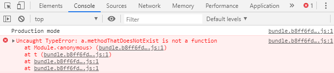
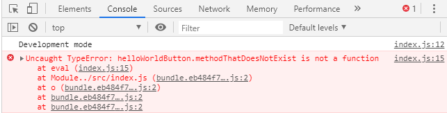
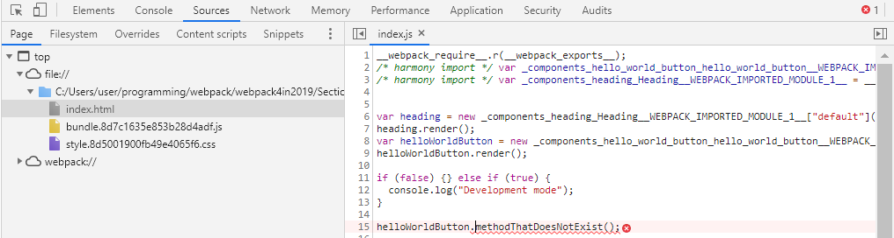
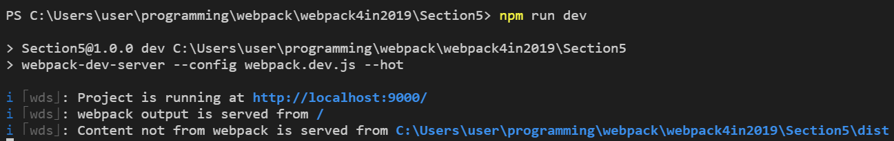

# Section5. Production vs Development Builds

Production과 Development의 차이점
* Production은 실제 유저에게 배포되는 결과물을 의미한다
* 이 시기에는 가능한 한 빠르고 용량이 적은 파일이 결과물로 나와야 한다
* 반면에 Development는 배포되기 이전의 결과물을 의미한다
* 이 시기에는 가능한 한 보기 편하고 유용한 정보들을 확인할 수 있어야 한다
  - ex. Source map으로 코드를 편하게 보면서 디버깅 할 수 있도록 하기
* 이처럼 Production과 Development는 구분해서 관리할 필요가 있다

앞선 프로젝트들에서의 mode
* 앞선 프로젝트들에서는 mode옵션을 전부 'none'으로 설정해놓았다
  - 이는 어떤 build optimization도 사용하지 않겠다는 의미다
* mode 옵션에는 none 이외에도 development와 production이 있다
* 두가지 옵션을 적용했을 때 어떤 점이 다른지 살펴보자

Error확인하기
* 우선 mode를 production으로 적용하고 의도적으로 에러를 만들어 확인해보자
```js
// (...)
module.exports = {
  entry: './src/index.js',
  output: {
    filename: 'bundle.[contenthash].js',
    path: path.resolve(__dirname, './dist'),
    publicPath: ''
  },
  mode: 'production',
  // (...)
};
```
* 참고로 production mode에서는 앞서 minify를 위해 적용했던 terser plugin은 자동으로 적용되므로 제거해도 된다

```js
// src/index.js
import HelloWorldButton from './components/hello-world-button/hello-world-button';
import Heading from './components/heading/Heading';

const heading = new Heading();
heading.render();
const helloWorldButton = new HelloWorldButton();
helloWorldButton.render();

if (process.env.NODE_ENV === "production") {
  console.log("Production mode");
} else if (process.env.NODE_ENV === "development") {
  console.log("Development mode");
}

helloWorldButton.methodThatDoesNotExist(); // 실제로 없는 메서드기 때문에 에러가 날 것이다
```
* 에러를 발생시키기 위해 없는 메서드를 실행한다

빌드 후 브라우저에서 확인해보기
```terminal
$ npm run build
```


* 에러가 난 부분이 번들파일의 첫번째 줄로 나온다
* production모드를 적용하면 모든 코드가 한 라인으로 모아져서 브라우저에서 디버깅이 힘들다

development로 mode를 바꾸고 확인해보기
```js
// (...)
module.exports = {
  entry: './src/index.js',
  output: {
    filename: 'bundle.[contenthash].js',
    path: path.resolve(__dirname, './dist'),
    publicPath: ''
  },
  mode: 'development',
  // (...)
  plugins: [
    // new TerserPlugin(), minify하는 플러그인은 디버깅을 편리하게 하기 위해 잠시 꺼두자
    // (...)
  ]
};
```
* 디버깅을 편리하게 하기 위해 plugins에서 소스를 minify하는 옵션도 중지시키자

빌드 후 브라우저에서 확인해보기
```terminal
$ npm run build
```


* 에러가 난 부분이 파일에서 몇번째 줄인지 확실히 알 수 있다


* 에러가 발생한 파일이름을 클릭해보면 위와 같이 어디서 에러가 발생했는지 쉽게 알 수 있다
* 개발환경에서는 이처럼 코드를 minify하지 않는 것이 디버깅에 편리하다

---

production과 development용 파일을 분리해서 관리하기
* 기존의 webpack.config.js파일을 두 개의 파일로 분리해서 관리하자
  - production용 : webpack.prod.js
  - development용 : webpack.dev.js

webpack.prod.js
```js
const path = require('path');
const MiniCssExtractPlugin = require('mini-css-extract-plugin');
const { CleanWebpackPlugin } = require('clean-webpack-plugin');
const HtmlWebpackPlugin = require('html-webpack-plugin');

module.exports = {
  entry: './src/index.js',
  output: {
    filename: 'bundle.[contenthash].js',
    path: path.resolve(__dirname, './dist'),
    publicPath: ''
  },
  mode: 'production',
  module: {
    rules: [
      {
        test: /\.(png|jpg)$/,
        use: [
          'file-loader'
        ]
      },
      {
        test: /\.css$/,
        use: [
          MiniCssExtractPlugin.loader, 'css-loader'
        ]
      },
      {
        test: /\.(scss|sass)$/,
        use: [
          MiniCssExtractPlugin.loader, 'css-loader', 'sass-loader'
        ]
      },
      {
        test: /\.js$/,
        exclude: '/node_modules/',
        use: {
          loader: 'babel-loader',
          options: {
            presets: [ '@babel/env' ],
            plugins: [ 'transform-class-properties' ]
          }
        }
      },
      {
        test: /\.hbs$/,
        use: [
          'handlebars-loader'
        ]
      }
    ]
  },
  plugins: [
    new MiniCssExtractPlugin({
      filename: 'style.[contenthash].css'
    }),
    new CleanWebpackPlugin({
      cleanOnceBeforeBuildPatterns: [
        '**/*',
        path.join(process.cwd(), 'build/**/*')
      ]
    }),
    new HtmlWebpackPlugin({
      title: 'Hello World',
      template: 'src/index.hbs',
      description: 'Some description'
    })
  ]
};
```
* production mode에서는 terser plugin이 제공하는 minify는 기본으로 적용되기 때문에 플러그인을 제거했다

webpack.dev.js
```js
const path = require('path');
const { CleanWebpackPlugin } = require('clean-webpack-plugin');
const HtmlWebpackPlugin = require('html-webpack-plugin');
// js, css를 minify해주는 플러그인들 제거

module.exports = {
  entry: './src/index.js',
  output: {
    filename: 'bundle.js', // hash를 적용해서 업데이트 여부를 확인할 필요가 없으니 제거했다
    path: path.resolve(__dirname, './dist'),
    publicPath: ''
  },
  mode: 'development',
  module: {
    rules: [
      {
        test: /\.(png|jpg)$/,
        use: [
          'file-loader'
        ]
      },
      {
        test: /\.css$/,
        use: [
          'style-loader', 'css-loader' // minify용 로더를 제거하고 style-loader적용 
        ]
      },
      {
        test: /\.(scss|sass)$/,
        use: [
          'style-loader', 'css-loader', 'sass-loader' // minify용 로더를 제거하고 style-loader적용
        ]
      },
      {
        test: /\.js$/,
        exclude: '/node_modules/',
        use: {
          loader: 'babel-loader',
          options: {
            presets: [ '@babel/env' ],
            plugins: [ 'transform-class-properties' ]
          }
        }
      },
      {
        test: /\.hbs$/,
        use: [
          'handlebars-loader'
        ]
      }
    ]
  },
  plugins: [
    // minify용 플러그인 제거
    new CleanWebpackPlugin({
      cleanOnceBeforeBuildPatterns: [
        '**/*',
        path.join(process.cwd(), 'build/**/*')
      ]
    }),
    new HtmlWebpackPlugin({
      title: 'Hello World',
      template: 'src/index.hbs',
      description: 'Some description'
    })
  ]
};
```
* 개발 모드에서는 minify나 hash로 업데이트 여부 확인하기, css를 파일로 분리할 필요가 없다

package.json파일에서 파일별로 스크립트 작성하기
```json
{
  /* (...) */
  "scripts": {
    "build": "webpack --config webpack.prod.js",
    "dev": "webpack --config webpack.dev.js"
  },
  /* (...) */
}
```
* 프로덕션용을 위해서는 npm run build를 사용하고
* 개발용을 위해서는 npm run dev를 사용하게끔 스크립트를 분리했다
* 각각의 스크립트를 사용해서 의도한 결과가 나오는지 확인해보자

---

webpack-dev-server를 이용해 수정된 사항을 바로 적용해서 확인하기
* webpack-dev-server를 사용하면 개발중에 수정된 내용이 생겼을 때 자동으로 브라우저에 반영해준다
* 설치하기
```terminal
$ npm i webpack-dev-server --save-dev
```

webpack.dev.js에 webpack-dev-server설정하기
```js
const path = require('path');
const { CleanWebpackPlugin } = require('clean-webpack-plugin');
const HtmlWebpackPlugin = require('html-webpack-plugin');

module.exports = {
  entry: './src/index.js',
  output: {
    filename: 'bundle.js',
    path: path.resolve(__dirname, './dist'),
    publicPath: ''
  },
  mode: 'development',
  devServer: {
    contentBase: path.resolve(__dirname, './dist'), 
    index: 'index.html',
    port: 9000
  },
  module: {
    rules: [
      {
        test: /\.(png|jpg)$/,
        use: [
          'file-loader'
        ]
      },
      {
        test: /\.css$/,
        use: [
          'style-loader', 'css-loader'
        ]
      },
      {
        test: /\.(scss|sass)$/,
        use: [
          'style-loader', 'css-loader', 'sass-loader'
        ]
      },
      {
        test: /\.js$/,
        exclude: '/node_modules/',
        use: {
          loader: 'babel-loader',
          options: {
            presets: [ '@babel/env' ],
            plugins: [ 'transform-class-properties' ]
          }
        }
      },
      {
        test: /\.hbs$/,
        use: [
          'handlebars-loader'
        ]
      }
    ]
  },
  plugins: [
    new CleanWebpackPlugin({
      cleanOnceBeforeBuildPatterns: [
        '**/*',
        path.join(process.cwd(), 'build/**/*')
      ]
    }),
    new HtmlWebpackPlugin({
      title: 'Hello World',
      template: 'src/index.hbs',
      description: 'Some description'
    })
  ]
};
```
* devServer에 3가지 옵션을 적용할 수 있다
  - contentBase에는 output폴더의 절대경로를 지정해야 한다. 이 경로에 있는 파일을 devserver가 추적한다
  - index에는 html파일을 지정한다
  - port에는 webpack-dev-server가 실행될 port를 지정한다

package.json에 development용 스크립트 수정하기
```json
{
  /* (...) */
  "scripts": {
    "build": "webpack --config webpack.prod.js",
    "dev": "webpack-dev-server --config webpack.dev.js --hot"
  },
  /* (...) */
}
```
* dev에는 webpack-dev-server를 사용한다
* npm run dev로 실행해보자


* localhost:9000로 접속해서 파일을 수정해보면 변경사항을 자동으로 반영해주는 것을 확인할 수 있다
* 앞서 index.js에 에러를 발생시키기 위해 임의로 작성했던 라인을 지우고 저장해보자
* 코드가 자동으로 반영되어 브라우저 콘솔에서 에러가 없어진 것을 확인할 수 있을 것이다
