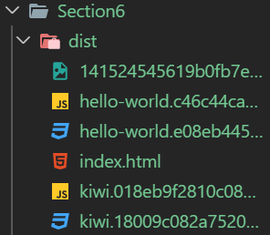
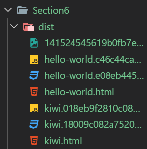
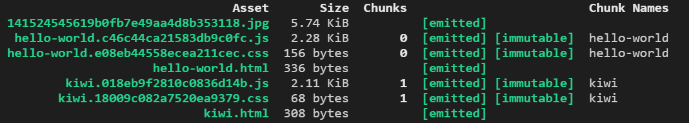
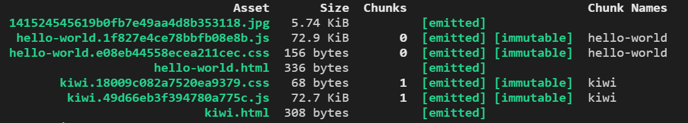
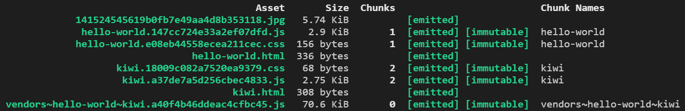
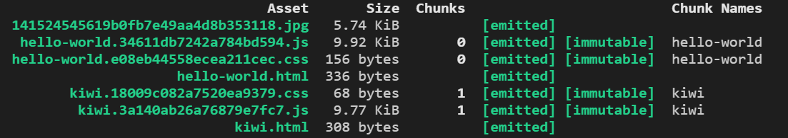
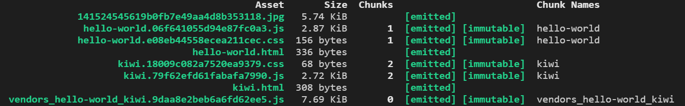

# Section6. Multiple Page Applications

지금까지의 작업들
* 웹팩으로 모든 파일을 하나의 자바스크립트 파일로 모았다
* 그런데 때로는 서버 측에서 엔드포인트 별로 각각의 자바스크립트 파일을 보내야 하는 상황처럼 여러 개의 파일이 필요한 경우도 있다
* 따라서 웹팩으로도 여러 파일로 코드를 스플릿팅 하는 방법도 알아둘 필요가 있다

키위 이미지를 보여주는 컴포넌트 작성
* 파일 구조는 다음과 같다
```txt
src
  components
    heading
    hello-world-button
    kiwi-image
      kiwi-image.js
      kiwi-image.scss
      kiwi.jpg
```
* img태그를 생성해 이미지를 body태그에 추가하는 간단한 코드를 작성해보자

```js
// src/components/kiwi-image/kiwi-image.js
import Kiwi from './kiwi.jpg';
import './kiwi-image.scss';

class KiwiImage {
  render() {
    const img = document.createElement('img');
    img.src = Kiwi;
    img.alt = "Kiwi";
    img.classList.add('kiwi-image');

    const body = document.querySelector('body');
    body.appendChild(img);
  };
};

export default KiwiImage;
```

```css
.kiwi-image {
  display: block;
  width: 400px;
  height: auto;
}
```

두 개의 페이지를 만들기
```txt
src
  components
    heading
    hello-world-button
    kiwi-image
index.js -> hello-world.js
kiwi.js
```
* 지금까지 작성한 컴포넌트로 hello-world, kiwi-image라는 두 개의 페이지를 만들 것이다
* heading은 두 페이지 모두에 포함되는 컴포넌트다
* index.js는 hello-world.js로 이름을 변경한다
* 그리고 kiwi.js파일을 생성하고 다음 코드를 추가하자

```js
// src/kiwi.js

import Heading from './components/heading/Heading';
import KiwiImage from './components/kiwi-image/kiwi-image';

const heading = new Heading();
heading.render();
const kiwiImage = new KiwiImage();
kiwiImage.render();
```

두 개의 엔트리 지정하기
```js
// webpack.prod.js

// (...)
module.exports = {
  entry: {
    'hello-world': './src/hello-world.js',
    'kiwi': './src/kiwi.js'
  },
  // (...)
}
```
* hello-world, kiwi라는 두 개의 프로퍼티를 entry에 추가했다
* 그리고 각각의 프로퍼티에 실제 파일의 경로를 지정했다

entry에서 추가한 프로퍼티를 output에 적용하기
```js
// webpack.prod.js

// (...)
module.exports = {
  entry: {
    'hello-world': './src/hello-world.js',
    'kiwi': './src/kiwi.js'
  },
  output: {
    filename: '[name].[contenthash].js',
    path: path.resolve(__dirname, './dist'),
    publicPath: ''
  },
  // (...)
};
```
* output의 filename프로퍼티에 \[name\]으로 entry에 등록한 프로퍼티마다 다른 파일이름을 가지도록 만들 수 있다

css파일에도 같은 방식을 적용하도록 플러그인 옵션 수정하기
```js
// webpack.prod.js

// (...)
module.exports = {
  entry: {
    'hello-world': './src/hello-world.js',
    'kiwi': './src/kiwi.js'
  },
  output: {
    filename: '[name].[contenthash].js',
    path: path.resolve(__dirname, './dist'),
    publicPath: ''
  },
  // (...)
  plugins: [
    new MiniCssExtractPlugin({
      filename: '[name].[contenthash].css'
    }),
    // (...)
  }
};
```
* 이제 css파일도 entry의 프로퍼티 이름마다 다른 css파일을 생성할 것이다

빌드 후 확인해보기
```terminal
$ npm run build
```


* entry에 지정한 프로퍼티 이름 별로 js,css파일이 분리되어 생성된 것을 확인할 수 있다

---

위에서 했던 코드스플릿팅으로 발생할 수 있는 문제점
* index.html 파일의 코드를 보자
```html
<!DOCTYPE html>
<html>
  <head>
    <meta charset="UTF-8">
    <title>Hello World</title>
    <meta name="description" content="Some description">
    <link href="hello-world.e08eb44558ecea211cec.css" rel="stylesheet">
    <link href="kiwi.18009c082a7520ea9379.css" rel="stylesheet">
  </head>
  <body>
    <script type="text/javascript" src="hello-world.c46c44ca21583db9c0fc.js"></script>
    <script type="text/javascript" src="kiwi.018eb9f2810c0836d14b.js"></script>
  </body>
</html>
```
* 하나의 html파일에서 모든 스플릿팅된 파일들을 불러오고 있다
* 물론 이 결과가 의도했던 것이라면 상관없다
* 하지만 entry프로퍼티마다 다른 html파일에서 각각 불러오는 것을 의도했다면 이런 방식은 사용할 수 없다

HtmlWebpackPlugin을 사용해서 별도의 html파일에서 스플릿팅된 파일을 불러오도록 설정하기
* 우선 Template역할을 하는 index.hbs를 page-template.hbs로 이름을 변경하자
```txt
src
  components
  hello-world.js
  kiwi.js
  index.hbs -> page-template.hbs
```
* webpack 설정 변경하기
```js
// webpack.prod.js

// (...)
module.exports = {
  entry: {
    'hello-world': './src/hello-world.js',
    'kiwi': './src/kiwi.js'
  },
  output: {
    filename: '[name].[contenthash].js',
    path: path.resolve(__dirname, './dist'),
    publicPath: ''
  },
  // (...)
  plugins: [
    new MiniCssExtractPlugin({
      filename: '[name].[contenthash].css'
    }),
    new CleanWebpackPlugin(),
    new HtmlWebpackPlugin({
      filename: 'hello-world.html',
      title: 'Hello World',
      description: 'Hello World',
      template: 'src/page-template.hbs'
    }),
    new HtmlWebpackPlugin({
      filename: 'kiwi.html',
      title: 'Kiwi',
      description: 'Kiwi',
      template: 'src/page-template.hbs',
    })
  ]
};
```
* HtmlWebpackPlugin을 두 번 적용한 것을 볼 수 있다
  - 같은 템플릿 파일에 filename별로 각각 다른 title,description을 지정했다
* 그런데 위와 같은 코드만으로 웹팩이 어떤 번들이 어떤 html파일에 있어야 하는지를 알 수는 없다
  - 이 문제를 해결하기 위해 HtmlWebpackPlugin에는 chunks라는 옵션이 있다

chunks옵션 추가하기
```js
// webpack.prod.js

// (...)
module.exports = {
  entry: {
    'hello-world': './src/hello-world.js',
    'kiwi': './src/kiwi.js'
  },
  output: {
    filename: '[name].[contenthash].js',
    path: path.resolve(__dirname, './dist'),
    publicPath: ''
  },
  // (...)
  plugins: [
    new MiniCssExtractPlugin({
      filename: '[name].[contenthash].css'
    }),
    new CleanWebpackPlugin(),
    new HtmlWebpackPlugin({
      filename: 'hello-world.html',
      chunks: [ 'hello-world' ],
      title: 'Hello World',
      description: 'Hello World',
      template: 'src/page-template.hbs'
    }),
    new HtmlWebpackPlugin({
      filename: 'kiwi.html',
      chunks: [ 'kiwi' ],
      title: 'Kiwi',
      description: 'Kiwi',
      template: 'src/page-template.hbs',
    })
  ]
};
```
* chunks옵션의 배열에는 복수의 entry프로퍼티를 지정할 수 있다 
* 여기서는 html파일마다 하나씩 필요하므로 하나씩만 지정했다

빌드 후 확인해보기
```terminal
$ npm run build
```


* 설정대로 2개의 html이 생성된것을 확인할 수 있다
* html파일마다 chunks에 넣었던 번들을 불러오는 것도 확인할 수 있을 것이다

hello-world.html
```html
<!DOCTYPE html>
<html>
  <head>
    <meta charset="UTF-8">
    <title>Hello World</title>
    <meta name="description" content="Hello World">
    <link href="hello-world.e08eb44558ecea211cec.css" rel="stylesheet">
  </head>
  <body>
    <script type="text/javascript" src="hello-world.c46c44ca21583db9c0fc.js"></script>
  </body>
</html>
```

kiwi.html
```html
<!DOCTYPE html>
<html>
  <head>
    <meta charset="UTF-8">
    <title>Kiwi</title>
    <meta name="description" content="Kiwi">
    <link href="kiwi.18009c082a7520ea9379.css" rel="stylesheet">
  </head>
  <body>
    <script type="text/javascript" src="kiwi.018eb9f2810c0836d14b.js"></script>
  </body>
</html>
```

---

여러 파일에 사용되는 공통 의존성 추출해내기
* 프로젝트를 진행하다보면 여러 파일에서 공통으로 사용하는 라이브러리가 있는 경우가 많다
* 이 때 해당 라이브러리를 파일마다 반복적으로 사용자에게 다운로드 받게 하는 것은 바람직하지 않다
* 간단한 예제를 통해 이 문제를 최적화하는 방법을 알아보자

heading.js의 render가 인자를 받아 동적으로 텍스트를 표현하도록 수정하기
```js
// heading.js
import './heading.scss';

class Heading {
  render(pageName) {
    const h1 = document.createElement('h1');
    const body = document.querySelector('body');
    h1.innerHTML = 'Webpack is awesome. This is "' + pageName + '"page';
    body.appendChild(h1);
  }
};

export default Heading;
```

hello-wolrd와 kiwi에서 각각 다른 인자 넘겨주기
```js
// hello-world.js
import HelloWorldButton from './components/hello-world-button/hello-world-button';
import Heading from './components/heading/Heading';
import _ from 'lodash'; // lodash를 불러오고 있다

const heading = new Heading();
heading.render(_.upperFirst('hello world'));
const helloWorldButton = new HelloWorldButton();
helloWorldButton.render();

// kiwi.js
import Heading from './components/heading/Heading';
import KiwiImage from './components/kiwi-image/kiwi-image';
import _ from 'lodash'; // lodash를 불러오고 있다

const heading = new Heading();
heading.render(_.upperFirst('kiwi'));
const kiwiImage = new KiwiImage();
kiwiImage.render();
```
* hello-world와 kiwi 모두 render메서드에 인자를 lodash로 첫글자만 대문자로 변경하고 있다

빌드 후 확인해보기
```terminal
$ npm run build
```

번들된 파일 사이즈를 비교해보기
* lodash를 반복적으로 불러오기 위해 두 파일 모두 70킬로바이트의 용량이 추가된 것을 확인할 수 있다

lodash를 사용하기 전 hello-world.js와 kiwi.js



lodash를 사용한 후의 hello-world.js와 kiwi.js



공통으로 사용하는 라이브러리를 추출해내 최적화하기
* 웹팩의 optimization의 splitChunks옵션으로 해결할 수 있다

```js
// (...)

module.exports = {
  // (...)
  mode: 'production',
  optimization: {
    splitChunks: {
      chunks: "all"
    }
  },
  // (...)
}
```

다시 빌드 후 확인해보기
```terminal
$ npm run build
```


* vendors\~hello-world\~kiwi.js라는 파일을 통해 반복해서 lodash를 다운받지 않아도 된다
* vendors\~hello-world\~kiwi.js와 kiwi.js, hello-world.js는 각각 별도로 캐쉬되어 사용될 것이다
* 그런데 브라우저에서 각각의 html파일을 열어보면 의도한 대로 동작하지 않는 것을 확인할 수 있을 것이다

```js
// (...)

module.exports = {
  // (...)
  mode: 'production',
  optimization: {
    splitChunks: {
      chunks: "all"
    }
  },
  // (...)
  plugins: [
    new MiniCssExtractPlugin({
      filename: '[name].[contenthash].css'
    }),
    new CleanWebpackPlugin(),
    new HtmlWebpackPlugin({
      filename: 'hello-world.html',
      chunks: [ 'hello-world', 'vendors~hello-world~kiwi' ],
      title: 'Hello World',
      description: 'Hello World',
      template: 'src/page-template.hbs'
    }),
    new HtmlWebpackPlugin({
      filename: 'kiwi.html',
      chunks: [ 'kiwi', 'vendors~hello-world~kiwi' ],
      title: 'Kiwi',
      description: 'Kiwi',
      template: 'src/page-template.hbs',
    })
  ]
}
```
* HtmlWebpackPlugin의 chunks옵션에 공통모듈이 있는 번들 파일을 추가해야한다
* 브라우저에서 각 html파일을 확인해보자. 의도한대로 잘 작동할 것이다

---

lodash를 걷어내고 react를 적용해보기
* 위에서 lodash로 했던 최적화를 react로도 해보자

```js
// hello-world.js
import HelloWorldButton from './components/hello-world-button/hello-world-button';
import Heading from './components/heading/Heading';
import React from 'react';

const heading = new Heading();
heading.render('hello world');
const helloWorldButton = new HelloWorldButton();
helloWorldButton.render();

// kiwi.js
import Heading from './components/heading/Heading';
import KiwiImage from './components/kiwi-image/kiwi-image';
import React from 'react';

const heading = new Heading();
heading.render('kiwi');
const kiwiImage = new KiwiImage();
kiwiImage.render();
```

react패키지 설치하기
```terminal
$ npm i --save react
```

빌드 후 확인해보기
```terminal
$ npm run build
```


* 우선 hello-world.js와 kiwi.js는 9킬로바이트 이상의 용량을 차지하고 있음을 확인할 수 있다
* 그리고 lodash를 공통으로 사용했을 때처럼 vendor~로 시작하는 번들파일이 생성되지 않고 있다
* 이는 Webpack이 기본적으로 30킬로바이트 이상인 모듈에 대해서만 자동으로 번들파일을 만들어 최적화하기 때문이다
* react는 lodash와 달리 30킬로바이트 이하의 모듈이므로 번들파일이 생성되지 않은 것이다
* 30킬로바이트 이하의 모듈은 optimization에 옵션을 변경해 최적화해야 한다 

```js
// (...)

module.exports = {
  // (...)
  mode: 'production',
  optimization: {
    splitChunks: {
      chunks: "all",
      minSize: 10000,
      automaticNameDelimiter: '_'
    }
  },
  // (...)
}
```
* minSize는 byte단위로 번들을 생성하는 최소 사이즈를 의미한다

빌드 후 확인해보기
```terminal
$ npm run build
```


* 공통 모듈을 담은 번들 파일은 optimization의 automaticNameDelimiter에 지정한 _로 파일이름이 분리되어 있다
* 이 파일에 의해 다시 hello-world.js와 kiwi.js는 2킬로바이트의 사이즈로 줄어든 것을 확인할 수 있다

---

Multipage application의 Development environment 설정하기
* mpa환경에서 webpack.dev.js의 설정을 어떻게 구성해야 하는지 알아보자

복수의 entry , output, HtmlWebpackPlugin 설정하기

```js
// webpack.dev.js

// (...)

module.exports = {
  entry: {
    'hello-world': './src/hello-world.js',
    'kiwi': './src/kiwi.js'
  },
  output: {
    filename: '[name].bundle.js',
    path: path.resolve(__dirname, './dist'),
    publicPath: ''
  },
  // (...)
  plugins: [
    new CleanWebpackPlugin(),
    new HtmlWebpackPlugin({
      filename: 'hello-world.html',
      chunks: [ 'hello-world' ],
      title: 'Hello World',
      description: 'Hello World',
      template: 'src/page-template.hbs',
    }),
    new HtmlWebpackPlugin({
      filename: 'kiwi.html',
      chunks: [ 'kiwi' ],
      title: 'Kiwi',
      description: 'Kiwi',
      template: 'src/page-template.hbs',
    })
  ]
};
```
* 대부분 production과 동일하므로 자세히 설명하지 않는다
* 다만 development환경에서는 공통모듈의 번들링 같은 작업은 신경쓰지 않아도된다

빌드 후 localhost:port/hello-world.html과 localhost:port/kiwi.html에서 확인해보자
```terminal
$ npm run dev
```