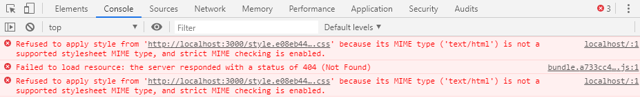

# Section7. Webpack Integration With Node And Express

Webpack을 서버와 함께 사용하기 위해 설정하기
* Node.js의 Express.js를 기준으로 설명한다
* 물론 Java, Ruby, Python 등 다른 백엔드 서버에서도 사용할 수 있다

간단한 코드 작성하기
```js
// src/server.js
const express = require('express');
const app = express();

app.get('/', (req, res) => {
  res.send("Some dummy content");
})

app.listen(3000, _ => {
  console.log('Application is running on http://localhost:3000/');
})
```
* GET / 엔드포인트로 접속했을 시 Some dummy content라는 텍스트를 리턴받는 서버다
* pacakge.json에 script를 등록해 서버를 실행해보자
```json
{
  /* (...) */
  "scripts": {
    "test": "echo \"Error: no test specified\" && exit 1",
    "build": "webpack --config webpack.prod.js",
    "dev": "webpack-dev-server --config webpack.dev.js --hot",
    "start": "node src/server.js"
  },
  /* (...) */
}
```

서버 시작하기
```terminal
$ npm start
```
* 브라우저에서 https://localhost:3000으로 접속해보면 Some dummy content가 반환된 화면이 보일 것이다

GET / 엔드포인트로 접속했을 때 html파일을 보내도록 수정하기
```js
const path = require('path');
const fs = require('fs');
const express = require('express');
const app = express();

app.get('/', (req, res) => {
  const pathToHtmlFile = path.resolve(__dirname, '../dist/index.html');
  const contentFromHtmlFile = fs.readFileSync(pathToHtmlFile, 'utf-8');
  res.send(contentFromHtmlFile);
})

app.listen(3000, _ => {
  console.log('Application is running on http://localhost:3000/');
})
```
* path와 fs모듈을 사용해 index.html을 전송하도록 코드를 변경했다
* 이제 index.html을 생성하도록 웹팩으로 빌드 한 후 서버를 재시작해 확인해보자

index.html을 생성하기 위해 웹팩으로 빌드하기
```terminal
$ npm run build
```

서버 재시작하기
```terminal
$ npm i --save-dev nodemon
```
* 우선 코드가 수정될때마다 자동으로 변경사항을 반영해 서버에 반영해주는 nodemon패키지를 설치하자

package.json파일에 script수정
```json
{
  /* (...) */
  "scripts": {
    "test": "echo \"Error: no test specified\" && exit 1",
    "build": "webpack --config webpack.prod.js",
    "dev": "webpack-dev-server --config webpack.dev.js --hot",
    "start": "nodemon src/server.js" /* node -> nodemon으로 변경 */
  },
  /* (...) */
}
```
* node를 nodemon으로 수정했다

서버를 재시작하기
```terminal
$ npm start
```


* 아마 브라우저에 아무런 내용도 보이지 않을 것이다
* console에서 확인해보면 static파일들을 제대로 가져오지 못하고 있는 것을 볼 수 있다

Express.js에 static file을 불러오는 경로를 알려주기
```js
const path = require('path');
const fs = require('fs');
const express = require('express');
const app = express();

app.get('/', (req, res) => {
  const pathToHtmlFile = path.resolve(__dirname, '../dist/index.html');
  const contentFromHtmlFile = fs.readFileSync(pathToHtmlFile, 'utf-8');
  res.send(contentFromHtmlFile);
})

/* /static 경로에서 static파일들을 가져오도록 지정 */
app.use('/static', express.static(path.resolve(__dirname, '../dist')));

app.listen(3000, _ => {
  console.log('Application is running on http://localhost:3000/');
})
```
* static 경로에서 static파일들을 가져오도록 지정했다
* 이제 웹팩으로 빌드된 html파일이 css,js파일을 /static/경로 하에서 찾도록 publicPath를 수정해야 한다

```js
// webpack.prod.js
// (...)

module.exports = {
  entry: './src/index.js',
  output: {
    filename: 'bundle.[contenthash].js',
    path: path.resolve(__dirname, './dist'),
    publicPath: '/static/'
  },
  // (...)
};
```
* 다시 웹팩으로 빌드 후 서버를 재시작해 보자

웹팩으로 빌드
```terminal
$ npm run build
```

서버 재시작
```terminal
$ npm start
```

만약 Section6에서처럼 Mulipage를 다뤄야 한다면
* Section6의 dist와 같이 hello-world.html과 kiwi.html이 있다고 가정한다
```js
const path = require('path');
const fs = require('fs');
const express = require('express');
const app = express();

/* GET /hello-world */
app.get('/hello-world/', (req, res) => {
  const pathToHtmlFile = path.resolve(__dirname, '../dist/hello-world.html');
  const contentFromHtmlFile = fs.readFileSync(pathToHtmlFile, 'utf-8');
  res.send(contentFromHtmlFile);
});

/* GET /kiwi */
app.get('/kiwi/', (req, res) => {
  const pathToHtmlFile = path.resolve(__dirname, '../dist/kiwi.html');
  const contentFromHtmlFile = fs.readFileSync(pathToHtmlFile, 'utf-8');
  res.send(contentFromHtmlFile);
})

/* /static 경로에서 static파일들을 가져오도록 지정 */
app.use('/static', express.static(path.resolve(__dirname, '../dist')));

app.listen(3000, _ => {
  console.log('Application is running on http://localhost:3000/');
})
```
* 서로 다른 엔드포인트에서 서로 다른 파을 가져오도록 지정하면 된다